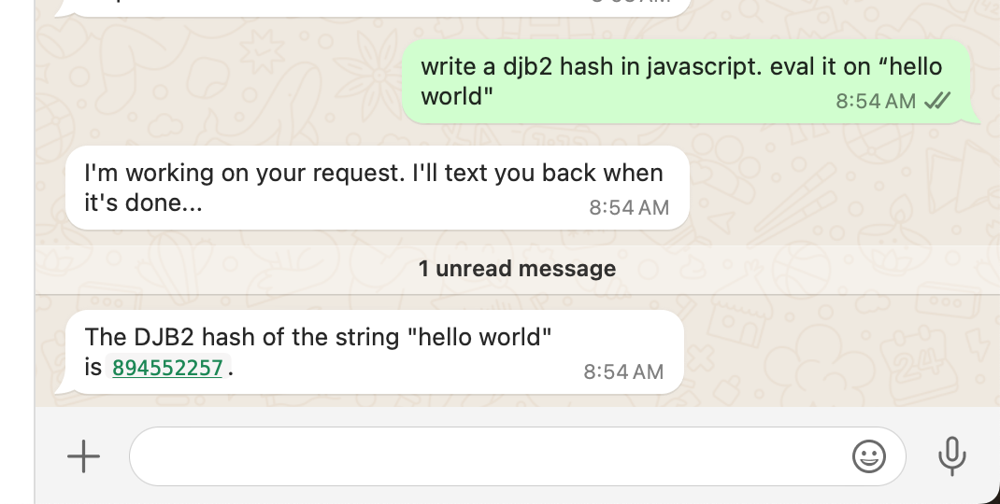

# MCP.run Twilio Integration

This uses a cloudflare worker as a twilio responder and shuttles the messages to
[mcp.run tasks](https://docs.mcp.run/tasks/using-tasks).

Example connected to the whatsapp sandbox:



## Setup

You need some secrets:

```
wrangler secret put TWILIO_ACCOUNT_SID = "<sid>"
wrangler secret put TWILIO_AUTH_TOKEN = "<token>"
wrangler secret put MCP_RUN_TOKEN = "<token>"
wrangler secret put SECRET_NONCE = "<any-generated-secret-nonce>"
```

The easiest setup to get started is [whatsapp sandbox](https://console.twilio.com/us1/develop/sms/try-it-out/whatsapp-learn)

Configure it to point at your cloudflare worker with your nonce as the url parameter, example:

```
When a message comes in                                                            Method
------------------------------------------------------------------------------------------
https://my-twillio-agent.mycompany.workers.dev/5bf4e85cbd047446e843a8856e164974    POST
```

You could also set this up with an SMS number or even call into it. But that's beyond the scope of this example.

